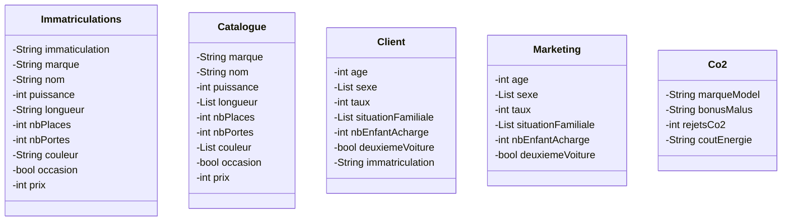
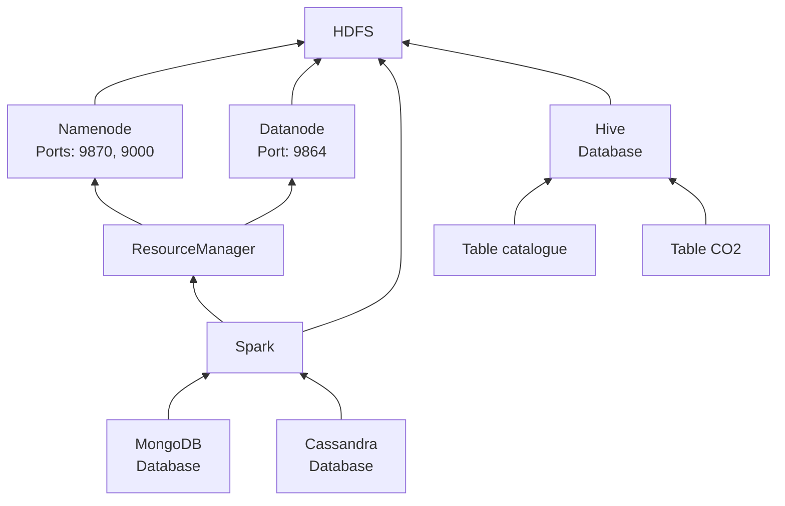

# Architecture du datalake

## Localisation des informations
| MongoDB         | HBase | HDFS      | HIVE   |
|-----------------|-------|-----------|--------|
| Immatriculation | Co2   | Catalogue | Client |
| -               | -     | Marketing |        |

