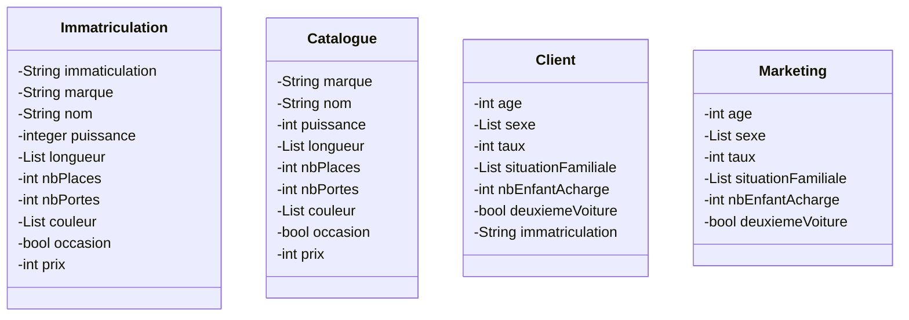

# Architecture du datalake

## Localisation des informations
| MongoDB         | Oracle NoSQL | HDFS      | HIVE   |
|-----------------|--------------|-----------|--------|
| Immatriculation | Co2          | Catalogue | Client |
| -               | -            | Marketing |        |

